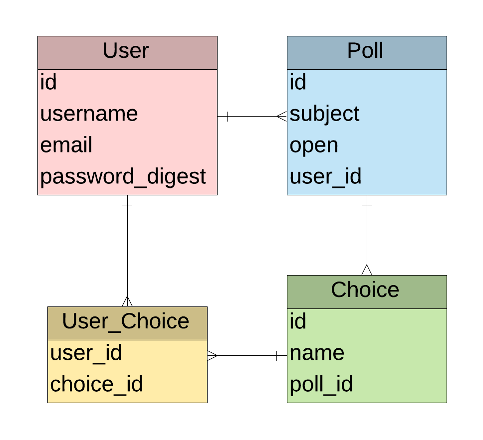
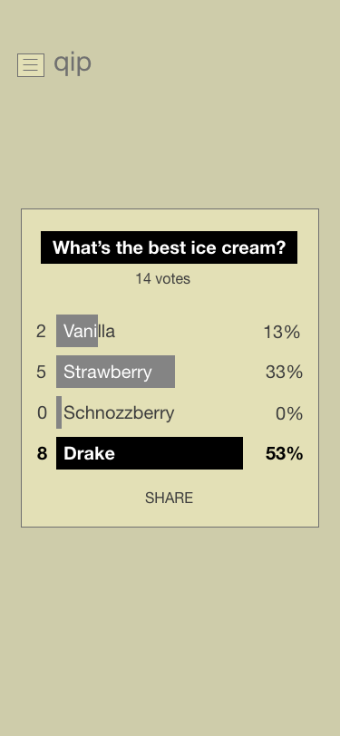
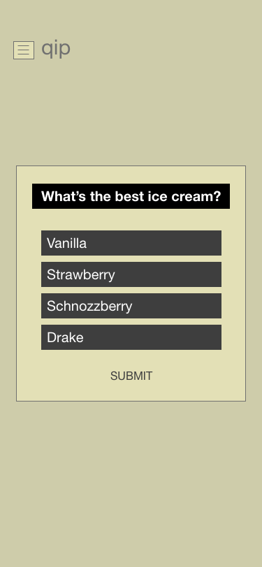
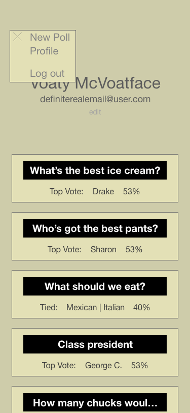

<!-- 

 -->

# QuickPoll

This is the 4th Project of NYC's General Assembly SEI Panda Cohort, created by Erinn Nelson.

## Project Outline

This app is designed to let users quickly create and share short polls for the purpose of data gathering in a friendly and easily digestable format.

_Site link not yet available_

Created with [React](https://reactjs.org/) and [Ruby on Rails](https://rubyonrails.org/)

### Set Up
* Fork and clone this repo
* cd into the app directory
* `bundle`
* run `rails s` to initialize the backend server
* `cd client`
* run `npm start` and allow the client server to run on an available port

## Feature List/User Stories
* As a group leader, I want to be able to get gather easy to understand feedback from my group so that I can understand what they want and/or feel
* As an event organizer, I would like to be able to see polls I created previously so that I can remember what decisions were made
* As a busy student, I want to be able to vote on a poll without having to register an account, so that I can move on quickly to other pressing matters

## ERD

## Wireframes

  

## MVP
* Users may create/edit/delete an account
* Registered users can create/delete and share polls
* Registered users may vote on polls (one time only)
* Registered users can view previously created polls
* Users may see poll results

## PostMVP
* Unregistered users can vote on polls (one time only)
* Polls can marked as closed by the creator
* Registered users can see their voting history
* Polls can be updated on the user's screen in realtime
* Users can change their vote

## Development Timeline

| **Complete Date** | **Task** |
| --- | --- |
| 8/12 | Server |
| 8/13 | Functional Front End |
| 8/14 | MVP |
| 8/15 | PostMVP: Unregistered user voting |
| 8/16 | Internal Presentations |
| 8/20 | PostMVP: Realtime results |
| 8/21 | External Presentations |

## Issues and Resolutions

| **Potential Problem** | **Proposed Solution:** |
| --- | --- |
| Update associations in choices_users join table | ??? |
| Stop users from voting more than once | Check all choices in a poll to see if user_id is present |
| Allowing non registered users to vote | Store IP address or similar user indicator as a temporary user |

## Additional Libraries

### React
* [Axios](https://www.npmjs.com/package/axios)
* [Data Driven Documents](https://www.npmjs.com/package/d3)
* [React Router Dom](https://www.npmjs.com/package/react-router-dom)
* [React Router Hash Link](https://www.npmjs.com/package/react-router-hash-link)
* [React Modal](https://www.npmjs.com/package/react-modal)
* [React OnClick Outside](https://www.npmjs.com/package/react-onclickoutside/v/4.8.0)

### Ruby
* [CORS](https://rubygems.org/gems/rack-cors/versions/0.4.0)
* [JSON Web Tokon](https://rubygems.org/gems/jwt/versions/1.5.4)
* [BCrypt](https://rubygems.org/gems/bcrypt/versions/3.1.12)
* [Awesome Print](https://rubygems.org/gems/awesome_print/versions/1.8.0)